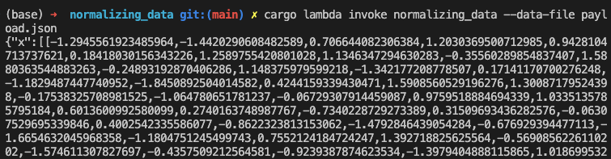

# AWS Lambda Function Guide

## What is an AWS Lambda Function?

AWS Lambda is a serverless computing service provided by Amazon Web Services (AWS). It allows you to run code without provisioning or managing servers, paying only for the compute time consumed by your code. Lambda functions can be triggered by various events, such as HTTP requests, changes in AWS services, or custom events.

## Understanding the Lambda Function

### Functionality

This Lambda function is designed to standardize input data by subtracting the mean and dividing by the standard deviation for each row in a matrix (`X`). It uses the following steps:

1. Calculate the mean and standard deviation for each row in the matrix `X`.
2. Subtract the mean from each element in the row.
3. Divide each element by the standard deviation.

The function takes input in the form of a JSON payload with the following structure:

```json
{
  "X": [[-47.51982116699219, 22.17236328125, 14.475106239318848,..,]] // Input data matrix (list of lists)
  "y": [0, 1,0,1,1...,1]                 // Output data vector (list)
}
```

- `x`: A matrix where each row represents a data sample.
- `y`: A vector representing the output labels or targets corresponding to each row in `X`.

The Lambda function processes this input, standardizes the `X` matrix, and returns the standardized data along with the original `y` vector.

### Input and Output Types

The function expects input with floating-point numbers (`f64`) for both `X` and `y` to perform the standardization correctly.

- Input (`Request`):
  - `x`: `Vec<Vec<f64>>` - Matrix of input data samples.
  - `y`: `Vec<f64>` - Vector of output labels or targets.

- Output (`Response`):
  - `x`: `Vec<Vec<f64>>` - Standardized input data matrix.
  - `y`: `Vec<f64>` - Unchanged output labels or targets.

## Usage

To use this Lambda function:

1. Create a JSON payload file (`payload.json`) with your input data in the specified format.

2. Invoke the Lambda function using the AWS CLI or Lambda console, providing the payload file as input.

   Using AWS CLI (this command runs locally):
   ```bash
   cargo lambda invoke normalizing_data --data-file payload.json  
   ```

3. Check the `output.json` file for the standardized data returned by the Lambda function. It would look like this:


